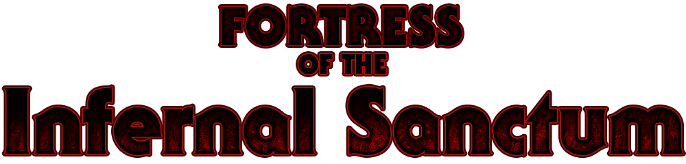
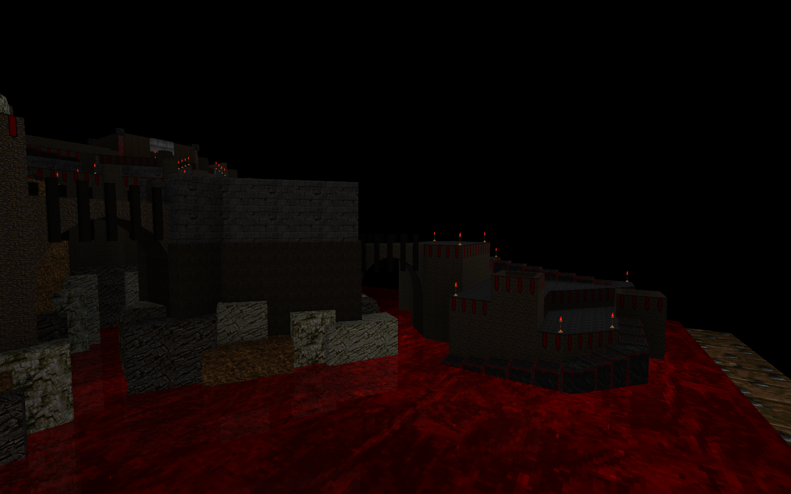
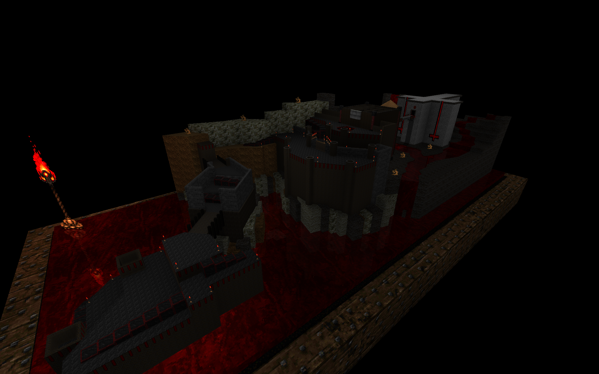
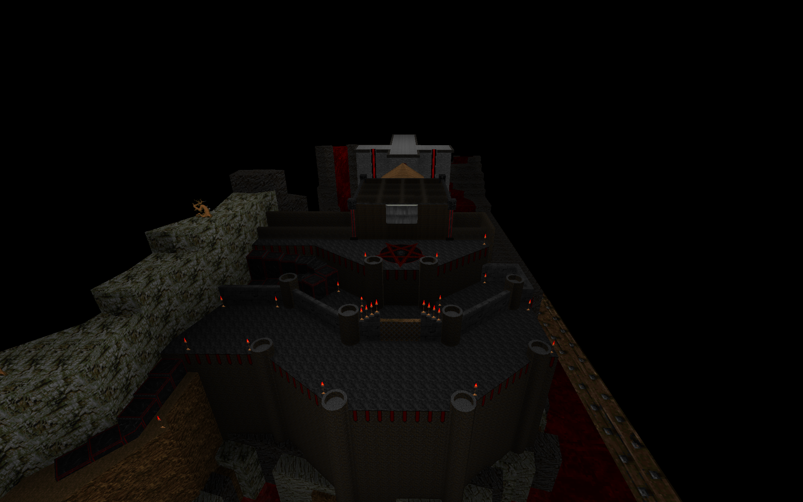
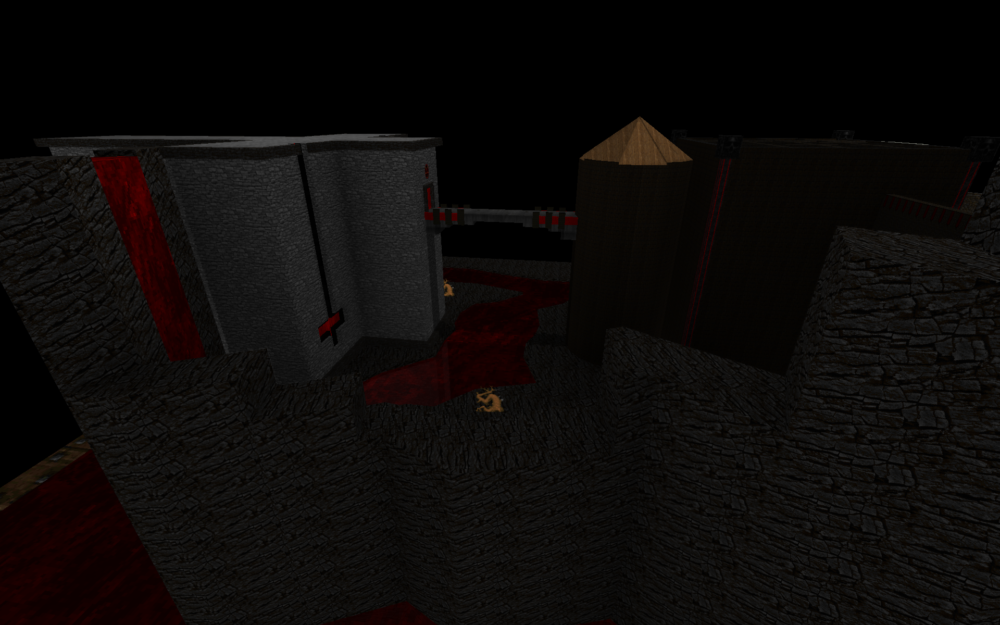
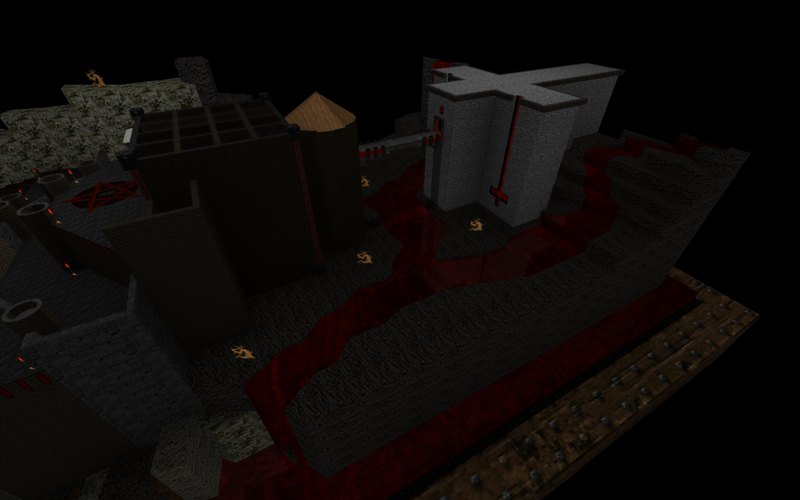

# Fortress of the Infernal Sanctum

A single large map for GZDoom featuring defensive fortress architecture, ~1052 enemies, an adaptive music system with 18 segments, and a cinematic title screen with a scale maquette diorama.

If you find it difficult, skill levels are implemented - try HNTR. Or if you just want to blaze through it.

See also [fotis.txt](fotis.txt)

[Download from Releases](https://github.com/goatprst/fotis/releases)

### Note about releases
There are three different variants available:
* fotis.pk3 -- this is the best, contains audio as 24-bit FLAC (RECOMMENDED)
* fotis-ogg.pk3 -- this version contains audio compressed with Ogg Vorbis (if somehow a few megabytes matters to you in this current year)
* fotis-nomusic.pk3 -- this version contains no audio files at all (if you must have the smallest possible download)

### Copyright / Permissions

Fortress of the Infernal Sanctum © 2025 by Nathaniel Roe (GOATPRST) is licensed under CC BY-NC-SA 4.0.
To view a copy of this license, visit
https://creativecommons.org/licenses/by-nc-sa/4.0/

OTEX © 2020 Ola Björling (ukiro)
To view a copy of this license, visit
https://doom.ukiro.com/otex-downloads/

OTEX textures located in textures/OTEX1.1/ while derived textures located in textures/hackOTEX/

Skybox imagery from Deep Star Maps: https://svs.gsfc.nasa.gov/4851/

All other images, text files, and music are the original work of Nate Roe.

Authors MAY use this level as a base to build additional
levels. Please borrow my scripts, ideas, and resources.
Please make new maps. Fork me on GitHub!
Give credit where it's due.

You MAY distribute this WAD, provided you include this file, with
or without modifications. You may distribute this file in any electronic
format (BBS, Telegraph, Data Cassette, Diskette, CD, Facsimile, etc) as
long as you include this file intact. You can also print it on paper,
engrave it in marble, carve into wooden strips, inscribe on papyrus, or
imprint into clay tablets. Probably you'll use the Internet though. That's
cool, too.
